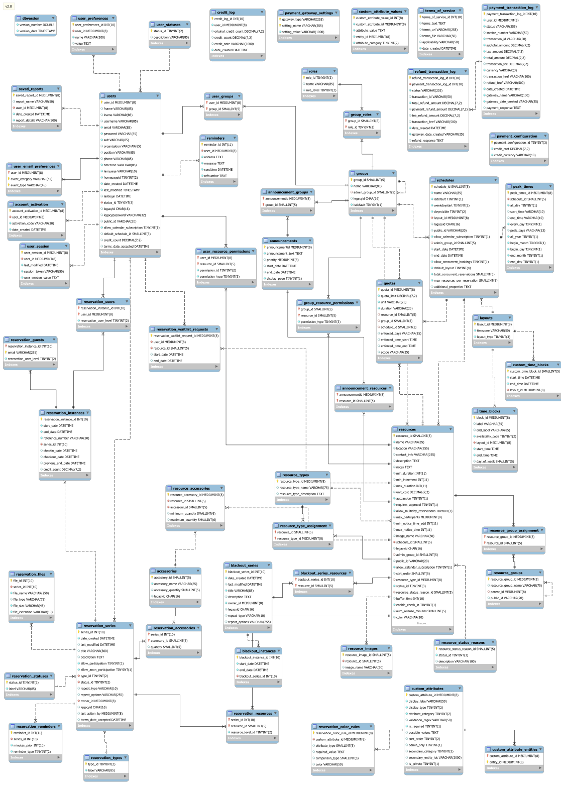

# Developer Documentation
## Design philosophy
The Model-View-Presenter (MVP) pattern is used to keep a clear separation between application logic and presentation logic.  
Page objects act as thin abstraction to the template engine and typically have no other logic.  
Presenter objects orchestrate interactions between underlying application logic objects and the page.  
This typically includes fetching and transforming data and minimal application logic.  

```
    [page].php should
        - define ROOT_DIR
        - include /Pages/[page]Page.php
        - construct [page]Page and call PageLoad()
```

- Each page should have at least one corresponding template in `/tpl`
- Each page should have a corresponding class in `/Pages`
- Each Page class should have a corresponding presenter class in `/Presenters`

Logically related code should be grouped in a directory with a "namespace.php" file, which requires all files in that directory.  
This simply makes it easier to include necessary file dependencies.

All classes should have good unit test coverage. The level of coverage is up to the developer, but I'd encourage TDD and .

## User interface
[Smarty template engine](https://www.smarty.net/docsv2/en/language.basic.syntax.tpl) is used for all UI presentation. Page templates are located in `/tpl` and, by default, are cached to `/tpl_c`

## Application Structure

    /config                     Application configuration
    /Controls                   All reusable page control objects
    /database_schema            Base and upgrade sql scripts

    /Domain                     Domain specific entities, repositories, services, etc
        /Access                    Domain repository objects (db abstraction layer)
        /Events                    Domain events
        /Values                    Value objects

    /Jobs                       All tasks that run on a schedule (cron tasks, for example)
    /lang                       Translations
    /lib                        All application supporting objects

        /Application               Most of the subdirectories are self-explanatory
            /Admin                  Application administration logic
            /Attributes             Custom attributes
            /Authentication         Authentication (login)
            /Authorization          Authorization (access)
            /Reporting              Logic for generating and running reports
            /Reservation        
                /Notification           Post-reservation logic
                /Persistence            Creating, updating, deleting reservation information
                /Validation             Pre-reservation logic
            /Schedule                   Schedule population
            /User

        /Common                     Non-specific shared objects (localization, dates, smarty, etc)
        /Config                     Configuration read/write
        /Database                   Database access and abstractions
        /Email                      Email abstractions and services
        /external                   Third party libraries
        /FileSystem                 Filesystem, I/O object
        /Graphics                   Creating and manipulating images
        /Server                     Web server abstractions (sessions, cookies, etc)
        /WebService                 Objects for creating and invoking web services (the API)

    /Pages                      Page binding and work flow logic
    /phing-tasks                Custom build tasks that hook into phing
    /plugins                    Contains subdirectories for each type of plugin
    /Presenters                 Application logic, page population
    /tests                      All unit tests
    /tpl                        All Smarty page and control templates
    /tpl_c                      Default Smarty template cache directory
    /uploads                    Default file upload directory
    /Web                        All user facing pages
        /scripts                    All application related javascript files
    /WebServices                The Booked API


# PHPDocumentor
use [phive](https://phar.io/) to install [phpDocumentor](https://phpdoc.org/) globally as not to not pollute the composer.json

# Database

open BookedScheduler.mbw with [MySQL Workbench](https://www.mysql.com/products/workbench/) to edit/update this ERD
